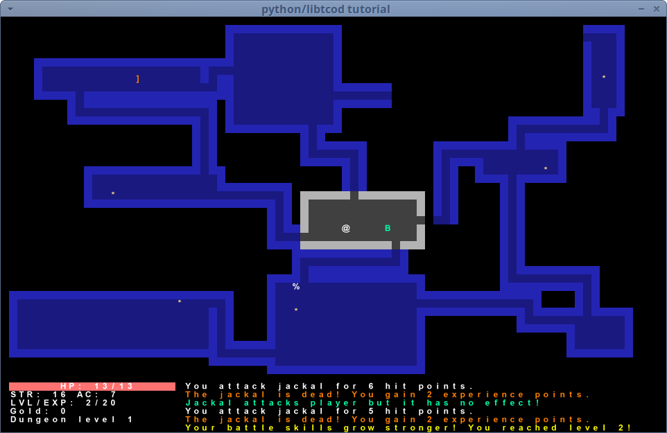

# A roguelike game

## Overview

This is a roguelike game that is based on 'Complete Roguelike Tutorial' from RogueBasin.
Many rules, items, monsters, and any other stuff taken from rogue 3.6.2 in The Rogue Archive have been incorporated. 

  

## Requirement

This program runs only on Python 3 and Linux.

## Usage

python3 ./roguelike.py

## Reference

[Complete Roguelike Tutorial in RogueBasin](https://www.roguebasin.com/index.php/Complete_Roguelike_Tutorial,_using_python%2Blibtcod)  
[libtcod 1.6.0](https://github.com/libtcod/libtcod/tree/1.6.0)  
[rogue 3.6.2](https://britzl.github.io/roguearchive)  

## Author

masahito3

## License

I want to follow the original tutorial's license, but I'm not sure what it is.
If possible, I would like to use the MIT license.

## What is on the screen

@ : the player  
: : food  
\* : gold  
) : weapon  
] : armor  
= : ring  
/ : wand  
? : scroll  
! : potion  
^ : trap  
, : amulet  
% : stairs
A-Z : monsters  
dark tile : passage or room  
bright tile : wall  

## Status display

HP : Hit Points  
STR : Strength the greater, the better  
AC : Armor Class the smaller, the better  
LVL : player's Level  
EXP : Experience  
Gold : The total amount of gold you have  
Dungeon level : The floor level within the dungeon  

## Key bindings

↑ : move up  
↓ : move down  
← : move left  
→ : move right  
KEYPAD8 : move up  
KEYPAD2 : move down  
KEYPAD4 : move left  
KEYPAD6 : move right  
KEYPAD7 : move up left  
KEYPAD9 : move right up  
KEYPAD1 : move left down  
KEYPAD3 : move right down  
KEYPAD5 : not move  
SPACE   : not move  
HOME    : move up left  
END     : move left down  
PAGEUP  : move right up  
PAGEDOWN : move right down  
y : move left up  
k : move up  
u : move right up  
h : move left  
l : move right  
b : move left down  
j : move down  
n : move right down  
g : pick up an item from the floor  
s : search for nearby tiles and walls  
i : open inventory  
d : open item drop menu  
c : open player's status  
t : open throw weapon menu  
\> : go up stairs  
\< : go down stairs  

## Monsters

A : giant ant  
B : bat  
C : centaur  
D : dragon  
E : floating eye  
F : violet fungi  
G : gnome  
H : hobgoblin  
I : invisible stalker  
J : jackal  
K : kobold  
L : leprechaun  
M : mimic  
N : nymph  
O : orc  
P : purple worm  
Q : quasit  
R : rust monster  
S : snake  
T : troll  
U : umber hulk  
V : vampire  
W : wraith  
X : xorn  
Y : yeti  
Z : zombie  

## Armors

leather armor  
ring mail  
studded leather armor  
scale mail  
chain mail  
splint mail  
bandid mail  
plate mail  

## Weapons

mace  
long sword  
bow  
arrow  
dagger  
rock  
two handed sword  
sling  
dart  
crossbow  
crossbow bolt  
spear  

## Wands

light  
striking  
lightning  
fire  
cold  
polymorph  
magic missile  
haste monster  
slow monster  
drain life  
nothing  
teleport away  
teleport to  
cancellation  

## Rings

protection  
add strength  
sustain strength  
searching  
see invisible  
adornment  
aggravate monster  
dexterity  
increase damage  
regeneration  
slow digestion  
teleportation  
stealth  

## Scrolls

monster confusion  
magic mapping  
light  
hold monster  
sleep  
enchant armor  
identify  
scare monster  
gold detection  
teleportation  
enchant weapon  
create monster  
remove curse  
aggravate monsters  
blank paper  
genocide  

## Potions

confusion  
paralysis  
poison  
gain strength  
see invisible  
healing  
monster detection  
magic detection  
raise level  
extra healing  
haste self  
restore strength  
blindness  
thirst quenching  

## Traps

trap door  
arrow trap  
sleeping gas trap  
beartrap  
teleport trap  
dart trap  

